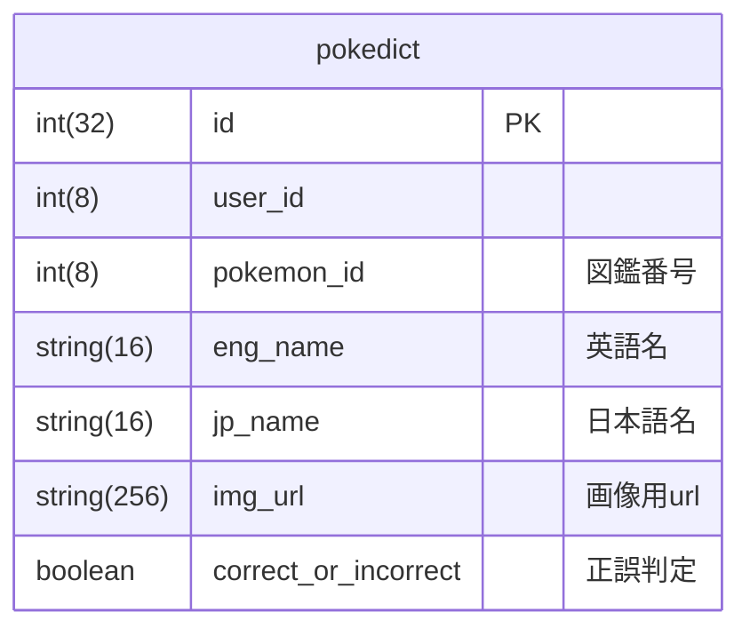

# PokeDict

子供が 4 歳になり、ピカチューだの、リザードンだの言い始めた。

自分は金銀でポケモンの記憶が終了している。

250 匹しか知らん。

今は、1000 匹以上いる。地獄絵図。

我が子「パパー。このポケモンなんて名前〜？」

自分「😀 シラネ」

???「ラジオ体操しまーす」

自分「😀 誰？」

英単語も覚えてないが、ポケモンの名前も覚えないと…。

そうだ！💡

## やりたいこと

PokeAPI の叩き方覚えたし、ポケモン図鑑を作ってみたい。

さあ、ポケモン言えるかなに挑戦だ。

テスト機能、復習機能も実装したよ！

## set up 手順

ざっくり手順のため手順の記載漏れが合った場合はご容赦ください。

1. この git を clone する
2. clone したディレクトリ内に移動
3. `npm install`
4. postgresql で pokedicts の DATABASE を作成
5. .env ファイルをルート直下に作成
   1. `DB_NAME=pokedicts`
   2. `DB_USER=あなたの設定`
   3. `DB_PASSWORD=あなたの設定`
   4. の 3 行を.env フォルダに記述
6. マイグレーションを行う`npm run migrate`
7. `npm run start`でサーバーを起動
8. `cd frontend` でクライアント側のフォルダへ移動
9. `npm isntall`
10. .env.develop を作成
11. `VITE_API_URL=http://localhost:3000/`を記入
    1. デプロイする場合は本番環境用の URL を.env.production に記入
    2. `VITE_API_URL=[あなたのURL]`を記入
12. `npm run dev` でフロントエンド側がレンダリングされます。
13. `http://localhost:5173` に Chrome でアクセスしてください

## データの構造

ER 図は下記の通り。

ユーザー名を取得しておいて、その値と正誤判定結果から間違えたポケモンのリストを取得する。
間違えたポケモンが苦手リストに入るような形。

再テストコーナーでは DB 城の記録から、間違えたポケモンだけで出題されます。

## 今後実装予定機能

正答率など詳細な数値データを取得！

グーグルアカウントを用いたログイン認証。

認証情報を元にユーザーごとに苦手リストを保持できるように修正。

## 実施項目

必須項目:

- [x] 1. データベース、サーバーとフロントが繋がっていて、機能しているか
  - [x] a. UI デザインへの取り組みはオプション
- [x] 2. データベースのスキーマがあるか、その他設定が整っているか
  - [x] a. Migration file があり、問題なく実行される
  - [x] b. knexfile に必須事項、環境変数が設定されている
  - [x] c. .env ファイルは、.gitignore に記載されている
- [x] 3. API のエンドポイントがあるか
  - [x] a. HTTP メソッドの get で実装している
- [x] 4. React を使用したフロントサイドが実装できているか
  - [x] a. useEffect/useState を使用 + 機能している
  - [x] b. 親コンポーネントと子コンポーネントがある

追加項目:

- [x] 5. API のエンドポイントが実装できている
  - [x] a. HTTP メソッドの post/patch/put/delete のどれか 1 つ以上実装
- [x] 6. バックエンドのテストがある
  - [x] a. 作成したエンドポイントのテストが 2 つ以上ある
- [x] 7. README が作成されている

  - [x] a. 明確なセットアップ手順、アプリの詳細、リソース、および将来の計画が記載されている
  - [x] b. 良い README の書き方がわからない場合はこちらをお読みください。
  - [ ] c. 新規のデベロッパーがあなたのアプリケーションを簡単にセットアップできるように、package.json 内にスクリプト(scripts)を記述する

- [x] 8. デプロイされている
  - [x] a. Render(無料)
- [ ] 9. Passport.js でログイン機能が実装されている
  - [ ] a. https://www.passportjs.org/

## デプロイ先

Render を使ってデプロイしました。

リンクはこちら

https://pokedict.onrender.com/

以上。
